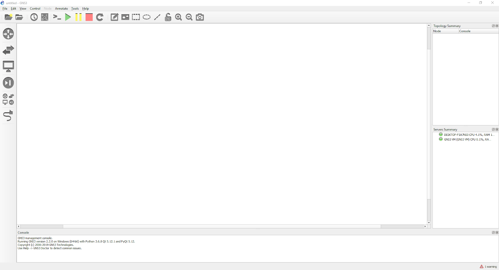

# GNS3 Setup

## GNS3 VM Info
- [user name and password](https://gns3.com/default-username-and-password)

## Installation Guide
- Select Version 2.2.45 regardless of your OS
  
#### Mac (Intel)
- [Official Install Guide](https://www.gns3.com/software/download)

#### Mac (Apple Silicon)
- [Instruction video](https://youtu.be/Ma2znNZQ574?si=n7eZnpdOKuyP-w06)
- VMWare Player [Free for personal use]: [https://customerconnect.vmware.com/evalcenter?p=fusion-player-personal-13](https://customerconnect.vmware.com/evalcenter?p=fusion-player-personal-13)
- GNS3 ARM VM: [https://github.com/GNS3/gns3-gui/releases/tag/v2.2.45](https://github.com/GNS3/gns3-gui/releases/tag/v2.2.45)
  - GNS3.VM.ARM64.2.2.45.zip
  - GNS3-2.2.45.dmg

#### Windows
- [Official Install Guide](https://www.gns3.com/software/download)

#### Native Linux
- [Official Install Guide](https://www.gns3.com/software/download)

## After Successful Installation
- After successful installation, you should launch the GNS3 client and see this screen.

## Terminology
- VPCS: Virtual PC Simulator
