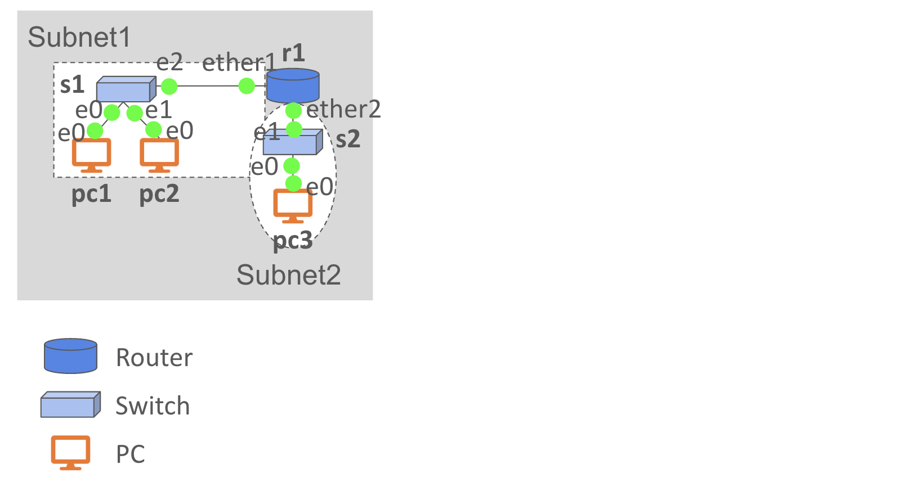
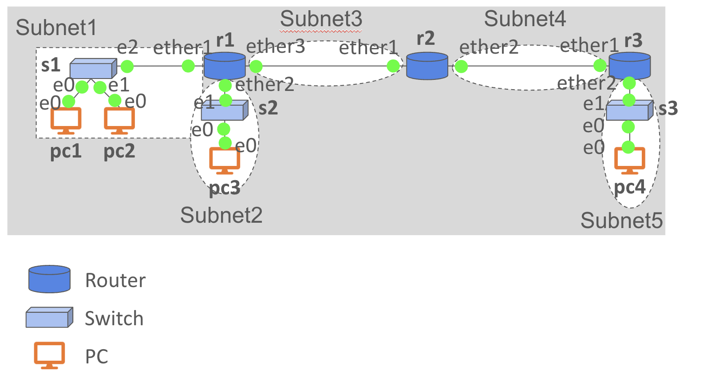

# a3: GNS3 Exercise

## Reference
- [GNS3 VPCS Commands](https://docs.gns3.com/docs/emulators/vpcs/)
- [Mikrotik Router Commands](https://help.mikrotik.com/docs/display/ROS/Command+Line+Interface)

## Subnet Design
Assume you are given an IP address range ```10.11.222.0/23``` for your company. You are going to prepare two subnets as follows.

- Subnet1: ```s1```, ```pc1```, ```pc2```
- Subnet2: ```s2```, ```pc3```



> __Task 1__: Decide appropriate ranges for the two subnets and fill in the following form: [Subnet Design Form](https://docs.google.com/spreadsheets/d/1xL05glb87I4BSy-VALyvEm6ORqa13Cw0RgIe7qoC1es/edit?usp=sharing).

> __Task 2__: Create a new GNS3 Project and set up the topology, following the IP addresses you decided. Take a screen capture.

> __Task 3__: Take a screen capture of the output of ```ip address print``` command at ```r1```.

> __Task 4__: Take a screen capture of the output of ```show ip``` command at ```pc1```.

> __Task 5__: Send ```ping``` from ```pc1``` to ```pc2```. Take a screen capture.

> __Task 6__: Send ```ping``` from ```pc1``` to ```pc3```. Take a screen capture.


## Static Routing
Expand the topology created in the previous problem by adding two more routers (```r2``` and ```r3```), one switch (```s3```), and a user device (```pc4```), as illustrated below.



> __Task 7__: Decide appropriate IP addresses for each device. Make sure that each subnet (subnet3, 4, 5) indicated in the diagram should have a disjoint range. Also, the address ranges should be disjoint from ```10.11.222.0/23```. Record the IP addresses in the form: [Subnet Design Form](https://docs.google.com/spreadsheets/d/1xL05glb87I4BSy-VALyvEm6ORqa13Cw0RgIe7qoC1es/edit?usp=sharing). 

> __Task 8__: Send ```ping``` from ```pc1``` to ```pc4```. Take a screen capture.

> __Task 9__: Take screen captures of the outputs of ```ip route print``` command at ```r1```, ```r2```, and ```r3```. (Check what this means.)

Read [this document](https://wiki.mikrotik.com/wiki/Manual:Simple_Static_Routing) and learn how to change the forwarding tables of a router by ```ip route add```.

> __Task 10__: Set appropriate forwarding table entries in each router so that you can send ping from ```pc1``` to ```pc4``` and from ```pc3``` to ```pc4```. Answer the command you executed.

> __Task 11__: Take screen captures of the outputs of ```ip route print``` command at ```r1```, ```r2```, and ```r3```. (It should be different from the previous answers.)

> __Task 12__: Start Wireshark on all links on the path from ```pc1``` to ```pc4```. Send ping from ```pc1``` to ```pc4``` again and find an ICMP packet sent from ```pc1``` to ```pc4``` on every link. Create and fill out the following table.

| Link      | Src IP | Dst IP | Src MAC | Dst MAC |
| ----------- | ----------- |----------- |----------- |----------- |
| pc1 - s1 |||||
| s1 - r1 |||||
| r1 - r2 |||||
| r2 - r3 |||||
| r3 - s3 |||||
| s3 - pc4 |||||


